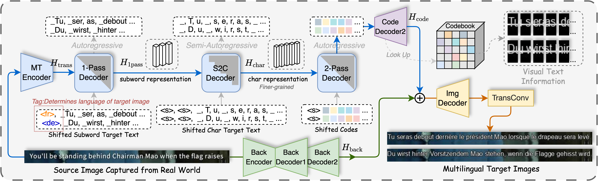
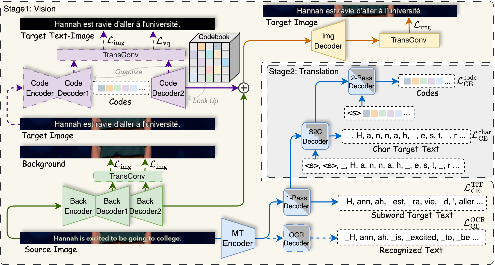

# PRIM

Official repository of PRIM: Towards Practical In-Image Multilingual Machine Translation (EMNLP 2025 Main).
[](https://arxiv.org/abs/2509.05146)

<p align="center">  </p>

## 📂 Dataset

* **PRIM Test Set**: [](https://huggingface.co/datasets/yztian/PRIM)
* **Training Set**: [](https://huggingface.co/datasets/yztian/MTedIIMT)

After downloading, you can check images in the training set with `./dataset/check_lmdb.ipynb`

We also provide:

* `iimt30k_lmdb.py` → Convert [IIMT30k](https://huggingface.co/datasets/yztian/IIMT30k) dataset into **lmdb** format, for training our model.
* `check_lmdb_iimt30k.ipynb` → Check images in IIMT30k lmdb format.

## 🚀 Training

VisTrans training involves **two stages**. Training logs are recorded via **[Weights & Biases](https://wandb.ai/)**.

<p align="center">
  
</p>

**Stage 1️⃣ Vision**

* Configs & scripts are in `./vision`
* Modify configs

> [!NOTE]
> `train_lmdb_path`, `val_lmdb_path`: the list of paths to training and validation lmdb;  
> `spm_path`: the sentencepiece model. For our data, please use ./multilingual_spm/total-35kbpe.model; for IIMT30k, please use ./iimt30k_spm/total-10kbpe.model;   
> `src_language_tags`, `tgt_language_tags`: the languages corresponding to train_lmdb_path and val_lmdb_path;  
> `save_checkpoint_dir`: path to save checkpoints.

Assign the --config, and run the training script:

```bash
cd ./vision/script
bash wandb_train.sh
```

After the training is finished, run inference to obtained the tokenized code sequence of images in training and validation sets:

```bash
cd ./vision/script
bash infer_code.sh
```

After that, you can get several files that stores code sequences, for example:

```bash
# train.de
# 7500 7500 7500 7500 7500 2209 6536 ...... 2209 7500 7500 7500 7500 7500
# ......
```

**Stage 2️⃣ Translation**

* Configs & scripts are in `./translation`
* Modify configs

> [!NOTE]
> `train_code_file_path`, `val_code_file_path`: the code file inferenced by infer_code.sh in stage 1. Make sure the vision_config and vision_ckpt are the same as in infer_code.sh;  
> `subspm_path`: the sentencepiece model for gererating char representation. For our data, please use ./multilingual_spm/total-char.model; for IIMT30k, please use ./iimt30k_spm/total-char.model.

Assign the --config, and run the training script:

```bash
cd ./translation/script
bash wandb_train.sh
```

## 🔍 Inference

We have released our trained model at [](https://huggingface.co/yztian/VisTrans)

We provide ready-to-use scripts:

* PRIM test set: `./infer_prim.sh`
* IIMT30k: `./infer_iimt30k.sh`

> [!NOTE]
> Set correct paths for `config` and `checkpoint` (Stage 2). The "vision_config" and "vision_ckpt" will be loaded automatically in translation config, which means you do not need to specify them in the inference bash scripts, so please verify that they are correct in the config trans.json.

## 📊 Evaluation

Evaluation consists of:

* **Textual quality** → BLEU, COMET (via `ocr.py`)
* **Visual quality** → FID

The example of evaluation commands are shown in `eval_prim.sh` and `eval_iimt30k.sh`.

Make sure to update paths before running.

## 📖 Citation

If you find our work helpful, we would greatly appreciate it if you could cite our paper:

```bibtex
@misc{tian2025primpracticalinimagemultilingual,
      title={PRIM: Towards Practical In-Image Multilingual Machine Translation}, 
      author={Yanzhi Tian and Zeming Liu and Zhengyang Liu and Chong Feng and Xin Li and Heyan Huang and Yuhang Guo},
      year={2025},
      eprint={2509.05146},
      archivePrefix={arXiv},
      primaryClass={cs.CL},
      url={https://arxiv.org/abs/2509.05146}, 
}
```
